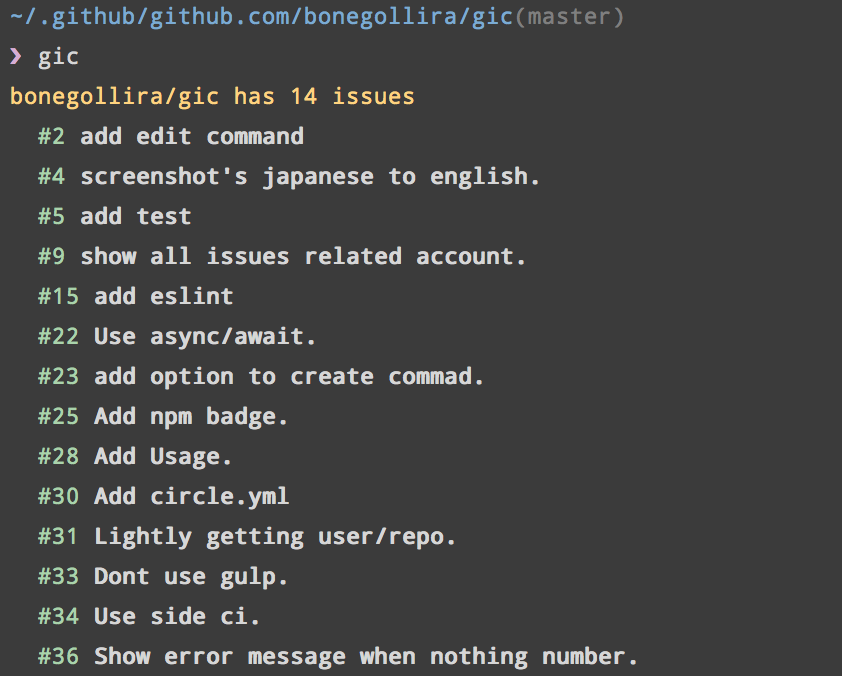

[](https://badge.fury.io/js/gic)

# gic
GitHub Issues Command line tool.

# Install

```sh
$ npm install -g gic
```

# Usage

set access token get from [tokens](https://github.com/settings/tokens)

```
// ~/.gitconfig

[gic "github.com"]
  token = [ACCESS TOKEN]

// if you use Github Enterprise
[gic "enterprise.github.com"]
  token = [ACCESS TOKEN]
```

or

```sh
$ git config --global gic.github.com.token [ACCESS TOKEN]
$ git config --global gic.enterprise.github.com.token [ACCESS TOKEN]
```

```sh
$ gic [command = list] [...options]
```

# Command

### list

```
$ gic list
```

Show all issues on repository.

### create

```
$ gic create
```

Create issue on repository, launch editor for write message.

### show [issue_number]

Need [user](https://developer.github.com/v3/oauth/#scopes) scope.

```
$ gic show 1
```

Show comments for issues.

### comment [issue_number]

Add new comment.

```
$ gic comment 1
```

### close [issue_number]

Close issue.

```
$ gic close 1
```

# Option

```
  --noprogress dont display progress log.
```


# Use with peco.

```
function peco-gic () {
  echo "\ngic list --noprogress"
  local selected_issue_number=$(gic list --noprogress | peco | sed -e 's/^  #\([0-9]*\).*$/\1/g')
  if [ -n "$selected_issue_number" ]; then
    BUFFER="gic show ${selected_issue_number}"
    zle accept-line
  fi
  zle clear-screen
}
zle -N peco-gic
bindkey "^N" peco-gic
```

# ScreenShot



# License

MIT
