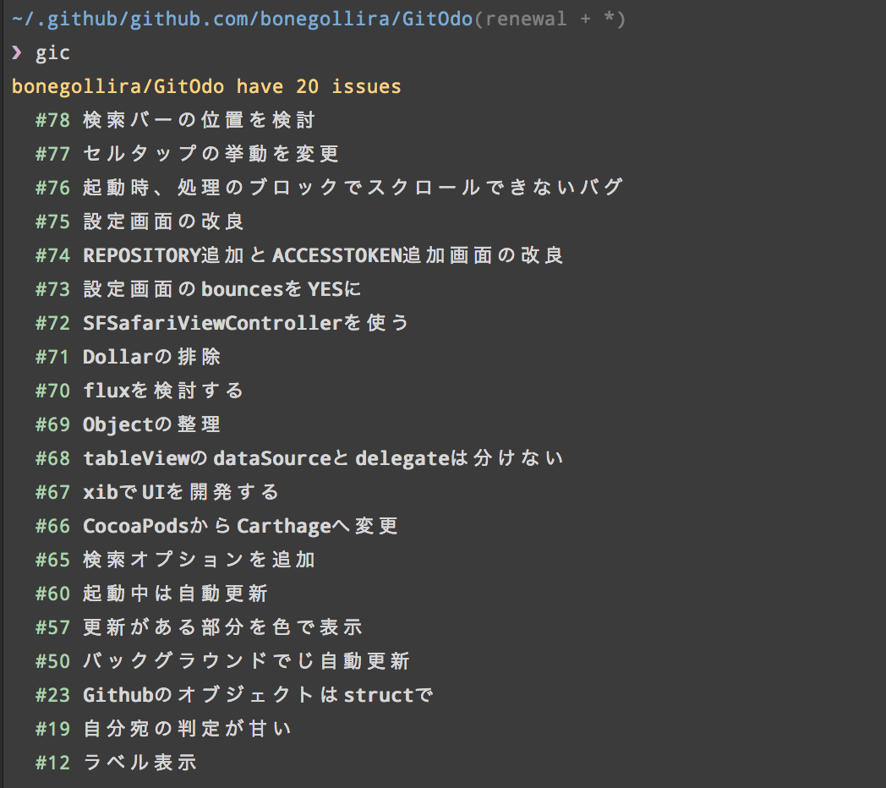

# gic
GitHub Issues Command line tool.

# Install

```sh
$ npm install -g gic
```

# Usage

set access token get from [tokens](https://github.com/settings/tokens)

```
// ~/.gitconfig

[gic "github.com"]
  token = [ACCESS TOKEN]

// if you use Github Enterprise
[gic "enterprise.github.com"]
  token = [ACCESS TOKEN]
```

or

```sh
$ git config --global gic.github.com.token [ACCESS TOKEN]
$ git config --global gic.enterprise.github.com.token [ACCESS TOKEN]
```

```sh
$ gic [command = list] [...options]
```

# Command

### list

```
$ gic list
```

Show all issues on repository.

### create

```
$ gic create
```

Create issue on repository, launch editor for write message.

### show [number]

Need user scope.

```
$ gic show 1
```

Show comments for issues.

# ScreenShot



# License

MIT
